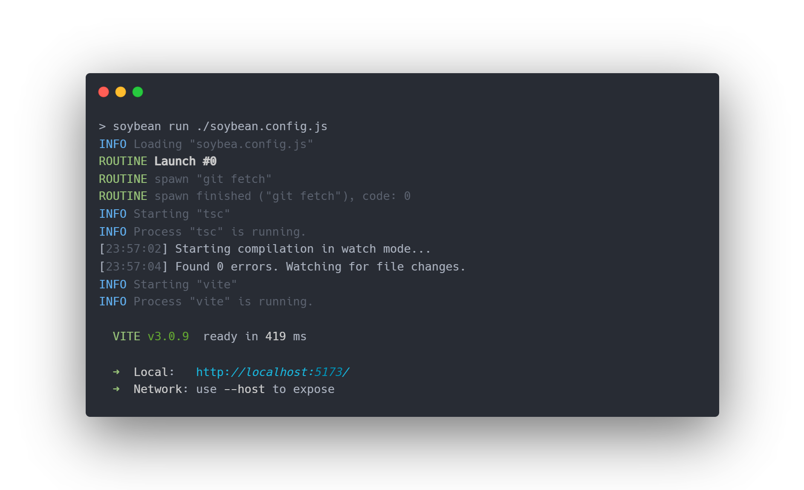

<!-- Back to top target element -->
<a name="readme-top"></a>

<h1 align="center">Soybean</h1>

<!-- Project splash screen -->

<p align="center">
    
<p>

## About the project
Soybean is an automation multi-tool that started as a simple script to ease the annoying process of spawning multiple compilers, frameworks and other CLI tools and constantly restarting them manually each time part of the code or configuration has changed.

Now Soybean is capable of:
- **Spawning and managing multiple child processes** such as compilers and frameworks from within a single terminal window - No more switching between terminal tabs to see what's broken.
- **Running automated tasks**, or "routines" based on events that happen as you do your work - Fetch the remote at the start of your work, restart your app on `.env` file change or run a shell command in an interval.
- **Letting you specify custom terminal command handlers** that allow you to run tasks on demand from within Soybean's terminal, along with keeping your command history and passing through unrecognized commands to a system shell like `zsh` or `powershell` - You don't need a separate terminal tab to interact with your OS.

## Table of contents
- [Getting started](#getting-started)
- [Configuration](#configuration)
    - [Child processes](#child-processes-configuration)
        - [Child process config options](#child-process-configuration-options)
    - [Routines](#routines)
        - [Launch routines](#launch-routines)
        - [Watch routines](#watch-routines)
            - [Watch routines config option](#watch-routines-configuration-options)
- [Modules](#modules)
    - [Event handlers](#handlers-module)
        - [Event object](#event-object)
        - [Miscellaneous handlers](#misc-handlers)
            - [`handle()`](#handle)
            - [`group()`](#group)
            - [`wait()`](#wait)
            - [`set()`](#set)
            - [`update()`](#update)
            - [`forEach()`](#foreach)
            - [`forOf()`](#forof)
            - [`forIn()`](#forin)
        - [File system](#fs-handlers)
            - [`fs.mkdir()`](#mkdir)
            - [`fs.readdir()`](#readdir)
            - [`fs.rmdir()`](#rmdir)
            - [`fs.rm()`](#rm)
            - [`fs.readFile()`](#readfile)
            - [`fs.writeFile()`](#writefile)
            - [`fs.copyFile()`](#copyfile)
            - [`fs.chmod()`](#chmod)
        - [Child process](#child-process-handlers)
        - [Shell](#shell-handlers)
        - [JSON](#json)
        - [Network](#network-handlers)
        

# Getting started
Soybean works on a basis that is followed by many other tools such as `vite` or `tsc`. It is a CLI tool available under the command `soybean` (or `sb` for convenience) that's initialized using a JavaScript configuration file.

## Installation
Soybean is a CLI tool, meaning it has to be installed globally to be accessible through shell.

1. Install globally
    ```bash
    npm install soybean@latest -g
    ```

2.  Alternatively, if you only need Soybean for a single project, you can install it locally and run it through an npm script.
    ```bash
    npm install soybean@latest --save-dev
    ```

    Inside of `package.json`:
    ```json
    {
        "scripts": {
            "soybean": "soybean run ./soybean.config.js"
        }
    }
    ```

# Configuration
Soybean by its design requires a configuration file that stores all of its settings used inside your project.

Create a new configuration file.
```bash
soybean init <file?>
```
The above command will create a boilerplate JavaScript config file as seen below.
```js
import { Soybean } from 'Soybean'
import h from 'Soybean/handlers'

export default Soybean({
    cp: {
        node: {
            command: ['node'],
            cwd: './',
            stdout: 'all'
        }
    },
    routines: {
        launch: [
            h.handle(() => console.log("Everything set up!"))
        ],
        watch: []
    },
    terminal: {
        passthroughShell: false,
        keepHistory: 50,
        handlers: {}
    }
})
```

## Child processes configuration
One of Soybean's core features is consolidating all your processes into a single terminal window.
Using the `cp` object in the Soybean config, you can easily set up multiple different instances of compilers, bundlers and different tasks.

Although having all your processes print out to the same terminal might seem messy at first, it saves lots of time switching between terminal windows/tabs looking at possible issues. Instead, everything can be spotted at an instant.

```js
Soybean({
    cp: {
        // Specify a child process' name
        typescript: {
            // Specify the spawn command
            command: ["tsc", ''],
            // And the CWD
            cwd: "./src" 
        },
        // And set up a yet another process
        static: {
            command: "http-server",
            cwd: "./dist" 
        }
    }
})
```

### Child process configuration options

| Property name | Type | Description |
| ------------- | ---- | ----------- |
| `command` | `string \| Array<string>` | Specifies the command used to spawn the child process. A simple `string` can be used for a bare command, like `tsc` or `vite` and an `Array<string>` to specify the command together with command parameters, eg. `["tsc", "-w", "--strict"]`. |
| `stdout` | `"all" \| "none"` | Specifies whether or not to pipe the child process' `STDOUT`, this will effectively mute the child process if used with `"none"` or display all of it's output if used with `"all"`. |
| `cwd` | `string` | The current working directory of the child process, relative to the Soybean configuration file. |
| `deferNext` | `number` | Time in `ms` for which to wait with further execution after spawning this process. This allows for tricks like spawning a compiler and waiting a second before spawning a different process that relies on the compiler's output. |

The child process' configuration object accepts the above properties, as well as standard options available for [`child_process.spawn()`](https://nodejs.org/api/child_process.html#child_processspawncommand-args-options) such as `shell` or `signal`, with exception of `stdio` and `detached` which were either disabled or altered due to how soybean operates.

# Routines
Routines are small pieces of code executed based on events that happen as you work on your project, such us when you modify a file or type a command in the terminal.

Routines use Soybean's [event handlers module](#event-handlers-module), a set of predefined methods to build tidy, easy to write procedures, such as moving a file, restarting a child process or calling a custom callback with your own code.

## Launch routines
Launch routines are really simple. All they do is run exactly once when soybean is spawned. This is useful when you want to prepare things before starting your work, such as fetching the remote.

```js
Soybean({
    routines: {
        launch: [
            // Run "git fetch" on startup
            handlers.shell.spawn(['git', 'fetch'])
        ]
    }
})
```

The above code will result in `git fetch` being called once each time Soybean is started:


## Watch routines
Watch routines are executed based on events coming from the file system, such as when you update a file, move it or delete it. They are especially useful when you can't use solutions like [Nodemon](https://www.npmjs.com/package/nodemon) and you would like to restart a program on file change.

```js
Soybean({
    routines: {
        watch: [
            {
                // Watch directory.txt
                file: './my/file/or/directory.txt',
                // Restart "my-program" when the file changes
                handle: handlers.cp.restart('my-program'),
                // Watch options
                options: { 
                    rateLimiter: 500 
                }
            }
        ]
    }
})
```

### Watch routines configuration options
| Property name | Type | Default value | Description |
| ------------- | ---- | ------------- | ----------- |
| `file`                | `string`      | -     | The target file or directory path that is being watched. |
| `handle`              | `Function`    | -     | The [event handler](#handlers-mofule) called whenever a watch event is fired. |
| `options.rateLimiter` | `number`      | `500` | The amount of time in milliseconds to wait after a watch event before the next one can be registered. |

The `options` object also accepts native [fs.watch](https://nodejs.org/docs/latest/api/fs.html#fswatchfilename-options-listener) options - `encoding`, `persistent`, `recursive` and `signal`.

# Modules

# Event handlers module
The handlers module is a set of methods that allow you to configure event handlers which handle events that occur in Soybean during your work. They happen when you save a file, type a command or as you launch Soybean itself.

## Event object
Each time an event handler is called in Soybean, a new event object is created containing the information about the event that ocurred.

The different types of events include:

- `SoybeanEvent` - The default object whose properties and information are available to every event handler used. All of the event objects below extend the `SoybeanEvent` class.
    - `SoybeanEvent.source` - The source of the event, which, depending on where it originated from can be one of - `"event"` (Default value), `"terminal"`, `"launch"`, `"watcher"`.
    - `SoybeanEvent.set()` - A method used to store data on the event object, which can then be retrieved and used later by a subsequent event handler inside a [handler group](#group-handler).
        ```ts
        event.set(key: string, data: any)
        ```
    - `SoybeanEvent.get()` - Used to retrieve a piece of data set on the event object with `set()`.
        ```ts
        event.get(key: string)
        ```
    - `SoybeanEvent.update()` - Used to update the value of an item stored on the event object with `set()`. It accepts a callback function used to process the variable and **return it** to be saved.
        ```ts
        event.update(key: string, callback: (data: any) => any)
        ```
    - `SoybeanEvent.updateAsync()` - The equivalent of the `update()` method used for asynchronous information.
        ```ts
        event.updateAsync(key: string, callback: (data: any) => Promise<any>)   
        ```
- `WatchEvent` - The event emitted by [watch routines](#watch-routines).
    - `WatchEvent.filename` (`string`) - Path to the file/directory where the event originated.
    - `WatchEvent.watchEventType` (`"rename" | "change"`) - The type of change.
        - All of which are available through `event.get()`.

- `TerminalEvent` - Event emitted when a user-specified command is entered in the integrated terminal.
    - `WatchEven.argv` (`string[]`) - An array of space-separated command parameters passed after the command keyword.
    - `WatchEven.argvRaw` (`"string"`) - The raw string of text passed after the command keyword.
        - All of which are available through `event.get()`.

## Miscellaneous handlers

### `handle()`
The `handle` event handler uses a traditional callback function to allow you to perform any kind of action not possible with Soybean's built-in handlers.

Additionally it has access to the [event object](#event-object) which allows it to interact with data shared with other handlers within the same [event group](#grouphandler).
```ts
handle(event: SoybeanEvent, callback: EventHandler)
```
```ts
handle(e => {
    const data = getSomeData()
    e.set('data', data)
})
```

### `group()`
The `group` handler allows you to group multiple handlers and share data between them.
This lets you create complex routines that perform a set of tasks on each event.

Inside of groups the event object includes an additional method `stopPropagation()` which lets you stop the group's execution when called.
```ts
group(handlers: EventHandler[])
```
```ts
group([
    // Read a file
    fs.readFile('./src/myConfig.json', 'my-config', 'utf-8'),
    // Parse it & save to "my-parsed-config"
    json.parse('my-config', 'my-parsed-config'),
    // Log it to the console
    handle(e => {
        console.log(event.get('my-parsed-config'))
    })
])
```

### `wait()`
The `wait` event handler lets you create a time gap inside a handler group.
```ts
wait(time: number)
```
```ts
group([
    handle(e => { event.set('start', Date.now()) }),
    wait(1000),
    // Will log "1000"
    handle(e => { console.log(Date.now() - e.get('start')) })
])
```

### `set()`
The `set` handler is used to set a property on the event object inside a handler group.
It is effectively a shorthand for `event.set` inside a `handle` event handler.
```ts
set(key: string, data: any)
```
```ts
group([
    set('config', fs.readFileSync('./config.js')),
    handle(e => console.log(e.get('config')))
])
```

### `update()`
The `update` handler is a shorthand for `event.update` & `event.updateAsync`.
It lets you quickly update a piece of information saved on the event object.
```ts
update(key: string, callback: (data: any) => any)
```
```ts
group([
    set('config', fs.readFileSync('./config.yaml')),
    update('config', (config) => {
        return YAML.parse(config)
    })
])
```

### `forEach()`
Loops over an array or string. Accepts direct reference or a symbol with a description matching the key to read from the event object.

Exposes `event.break` and `event.continue` methods to manage the loop's operation. All of them accept an ID to target a specific loop

Inside `forEach` loops, three items are available through `get()` on the event object:
- `"array"` - The array that the loop is iterating over.
- `"index"` - The current array index inside the loop.
- `"value"` - The current value from the array the loop is iterating over.

**Note:** If the loop has an ID set, all the above properties will be prefixed with its ID.  
Eg. For a loop labeled as `"loop1"`, the `"value"` property would be changed `"loop1-value"`. This lets you nest loops and groups inside each other without variable naming conflicts.

```ts
forEach(iterable: symbol | any[], handler: EventHandler)
forEach(iterable: symbol | any[], id: string, handler: EventHandler)
```
```ts
forEach([1, 2, 3, 4, 5], handle(e => {
    console.log(e.get('value'))
}))
```
```ts
group([
    set('my-array', [1, 2, 3, 4, 5]),
    forEach(Symbol("my-array"), handle(e => {
        console.log(e.get('value'))
    }))
])
```

### `forOf()`
Loops over an iterable object or array. Accepts an iterable object  or a symbol with a description matching the key to read from the event object.

Exposes `event.break` and `event.continue` methods to manage the loop's operation. All of them accept an ID to target a specific loop

Inside `forOf` loops, two items are available through `get()` on the event object:
- `"object"` - The object that the loop is iterating over.
- `"value"` - The current value read from the iterated object.

**Note:** If the loop has an ID set, all the above properties will be prefixed with its ID.  
Eg. For a loop labeled as `"loop1"`, the `"value"` property would be changed `"loop1-value"`. This lets you nest loops and groups inside each other without variable naming conflicts.

```ts
forOf(iterable: symbol | Iterable, handler: EventHandler)
forOf(iterable: symbol | Iterable, id: string, handler: EventHandler)
```
```ts
forOf([1, 2, 3, 4, 5], handle(e => {
    console.log(e.get('value'))
}))
```
```ts
group([
    set('values', [1, 2, 3, 4, 5])
    forOf(Symbol('values'), handle(e => {
        console.log(e.get('value'))
    }))
])
```

### `forIn()`
Loops over enumerable string properties of an object. Accepts an enumerable object or a symbol with a description matching the key to read from the event object. 

Exposes `event.break` and `event.continue` methods to manage the loop's operation. All of them accept an ID to target a specific loop

Inside `forIn` loops, three items are available through `get()` on the event object:
- `"object"` - The reference to the object being looped over.
- `"key"` - The current object key inside the loop.
- `"value"` - The current value read from the object.

**Note:** If the loop has an ID set, all the above properties will be prefixed with its ID.  
Eg. For a loop labeled as `"loop1"`, the `"value"` property would be changed `"loop1-value"`. This lets you nest loops and groups inside each other without variable naming conflicts.

```ts
forIn(iterable: symbol | Record<any, any>, handler: EventHandler)
forIn(iterable: Record<any, any>, id: string, handler: EventHandler)
```
```ts
forIn({ a: 1, b: 2, c: 3 }, handle(e => {
    console.log(e.get('value'))
}))
```
```ts
group([
    set('values', { a: 1, b: 2, c: 3 })
    forIn(Symbol('values'), handle(e => {
        console.log(e.get('value'))
    }))
])
```

## FS handlers

### `fs.mkdir()`
Used to create a new directory.
Accepts either a `string` path or a `symbol` with a description matching a key to read from the event object in place of the text path.

```ts
fs.mkdir(path: string | symbol, options: MkdirOptions)
```
```ts
fs.mkdir('./relative/to/soybean-config/')
```
```ts
group([
    set('path', './some/path')
    fs.mkdir(Symbol('some-path'))
])
```

### `fs.readdir()`
Reads the contents of a directory and saves it on the event object.
Accepts a `string` path or a `symbol` with a description matching a key to read from the event object in place of the path, a `string` which is used to save the results on the event object and read options the same as in the native [`fs.readdir`](https://nodejs.org/api/fs.html#fsreaddirpath-options-callback).
```ts
fs.readdir(path: string | symbol, saveTo: string, options?: ReaddirOptions)
```
```ts
group([
    fs.readdir('./relative/to/soybean-config/', 'my-dir'),
    handle(e => console.log(e.get('my-dir')))
])
```

### `rmdir()`
Removes a directory.
Accepts a `string` path or a `symbol` with a description matching a key to read from the event object and an options object (see native [`fs.rmdir`](https://nodejs.org/api/fs.html#fsrmdirpath-options-callback) options).

```ts
fs.rmdir(path: string | symbol, options?: RmdirOptions)
```
```ts
fs.rmdir('./path/to/remove', { recursive: true })
```
```ts
group([
    set('path', './my/path/'),
    fs.rmdir(Symbol('path'))
])
```

### `rm()`
### `readFile()`
### `writeFile()`
### `copyFile()`
### `chmod()`