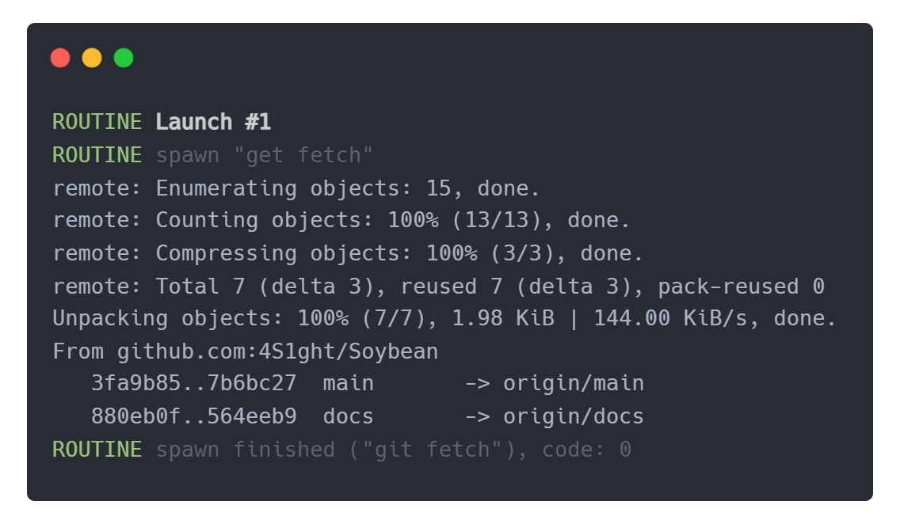

# Soybean
Ever needed to manually move or update a file or restart a buggy compiler?  
Soybean is a convenience multi-tool for automating such tedious tasks.  
It lets you set up your compilers, bundlers and the rest of the environment and get to work with a single command.  
Write tidy and concise routines executed on a plethora of events, such as a file change, command input or an interval!

# Documentation
- [Installation](#installation)
- [Configuration](#configuration)
- [Routines](#routines)
    - [Launch routines](#launch-routines)
    - [Watch routines](#watch-routines)
- [Integrated terminal](#integrated-terminal)
- [Modules](#modules)
    - [Handlers module](#handlers-module)

# Installation

Install Soybean with `npm`:
```
npm install soybean
```

With `yarn`:
```
yarn install soybean
```

**Note:** To be able to spawn Soybean from the terminal without using [NPM scripts](https://docs.npmjs.com/cli/v10/using-npm/scripts), you will need to install Soybean globally:
```
npm install Soybean --global
```

# Configuration
Similar to Vite or the TS compiler, Soybean is a CLI tool that lets you easily create a boilerplate configuration file:

```
soybean init
```

Or if you would like to specify the path yourself:
```
soybean init ./myConfig.js
```

Alternatively, you can use the shorthand command `sb` instead of `soybean`.

```
sb init
```

The above command will create a new configuration file in the chosen destination.
```js
import { Soybean } from 'Soybean'
import h from 'Soybean/handlers'

export default Soybean({
    cp: {},
    routines: {
        launch: [],
        watch: []
    },
    terminal: {
        passthroughShell: false,
        keepHistory: 50,
        handlers: {}
    }
})
```

After the configuration file is created you will be able to run soybean with settings specified in the `<file>`.  
If no file is specified, the program will default to using `config.soybean.js` and show an error message if it's not found.
```
soybean run <file>
```

# Routines
Routines are singular tasks or sets of grouped tasks executed in result of an event, be it a file change,
time interval or a custom user-defined command. Routines make use of Soybean's [handlers module](#handlers-module) 
that offers a set easy of quick to implement event handlers.

There are a couple different types of routines executed based on different circumstances:
- [Launch routines](#launch-routines)
- [Watch routines](#watch-routines)

## Launch routines
**Launch routines are executed each time you start Soybean.**  
This is useful when you need to prepare different aspects of your project each day, like automatically 
fetching latest changes in the repository or latest binaries from a build server.

An example launch routine like this one would perform a `git fetch` shell command and log the output to the console, like below.
```js
Soybean({
    routines: {
        launch: [
            // Perform "git fetch"
            handlers.shell.spawn(['git', 'fetch'], {})
        ]
    }
})
```
<p align="center">
    
</p>

## Watch routines


# Modules

## Handlers module


<!-- 
GIT FETCH LAUNCH ROUTINE SNIPPET
https://carbon.now.sh/?bg=rgba%28248%2C231%2C28%2C0%29&t=one-dark&wt=none&l=auto&width=667.5999997854233&ds=false&dsyoff=20px&dsblur=68px&wc=true&wa=true&pv=15px&ph=17px&ln=false&fl=1&fm=Hack&fs=13.5px&lh=153%25&si=false&es=2x&wm=false&code=ROUTINE%2520Launch%2520%25231%250AROUTINE%2520spawn%2520%2522get%2520fetch%2522%250Aremote%253A%2520Enumerating%2520objects%253A%252015%252C%2520done.%250Aremote%253A%2520Counting%2520objects%253A%2520100%2525%2520%2813%252F13%29%252C%2520done.%250Aremote%253A%2520Compressing%2520objects%253A%2520100%2525%2520%283%252F3%29%252C%2520done.%250Aremote%253A%2520Total%25207%2520%28delta%25203%29%252C%2520reused%25207%2520%28delta%25203%29%252C%2520pack-reused%25200%250AUnpacking%2520objects%253A%2520100%2525%2520%287%252F7%29%252C%25201.98%2520KiB%2520%257C%2520144.00%2520KiB%252Fs%252C%2520done.%250AFrom%2520github.com%253A4S1ght%252FSoybean%250A%2520%2520%25203fa9b85..7b6bc27%2520%2520main%2520%2520%2520%2520%2520%2520%2520-%253E%2520origin%252Fmain%250A%2520%2520%2520880eb0f..564eeb9%2520%2520docs%2520%2520%2520%2520%2520%2520%2520-%253E%2520origin%252Fdocs%250AROUTINE%2520spawn%2520finished%2520%28%2522git%2520fetch%2522%29%252C%2520code%253A%25200
-->