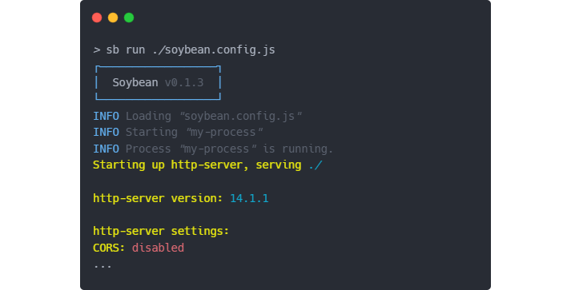
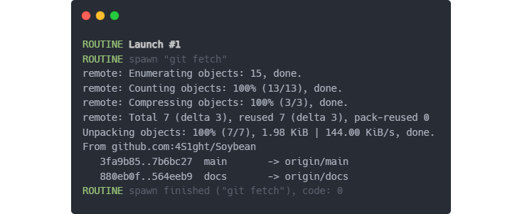

# Soybean
Ever needed to manually move or update a file or restart a buggy compiler?  
Soybean is a convenience multi-tool for automating such tedious tasks.  
It lets you set up your compilers, bundlers and the rest of the environment and get to work with a single command.  
Write tidy and concise routines executed on a plethora of events, such as a file change, command input or an interval!

# Documentation
- [Installation](#installation)
- [Configuration](#configuration)
- [Child processes](#child-processes)
    - [Spawn options](#child-process-spawn-options)
- [Routines](#routines)
    - [Launch routines](#launch-routines)
    - [Watch routines](#watch-routines)
- [Integrated terminal](#integrated-terminal)
- [Events](#events)
    - [Event handlers](#event-handlers)

# Installation

Install Soybean with `npm`:
```
npm install soybean
```

With `yarn`:
```
yarn install soybean
```

**Note:** To be able to spawn Soybean from the terminal without using [NPM scripts](https://docs.npmjs.com/cli/v10/using-npm/scripts), you will need to install Soybean globally:
```
npm install Soybean --global
```

# Configuration
Similar to Vite or the TS compiler, Soybean is a CLI tool that lets you easily create a boilerplate configuration file:

```
soybean init
```

Alternatively, you can use the shorthand command `sb` instead of `soybean`.
```
sb init
```

The above command will create a new configuration file in the chosen destination.
```js
import { Soybean } from 'Soybean'
import h from 'Soybean/handlers'

export default Soybean({
    cp: {},
    routines: {
        launch: [],
        watch: []
    },
    terminal: {
        passthroughShell: false,
        keepHistory: 50,
        handlers: {}
    }
})
```

After the configuration file is created you will be able to run soybean with settings specified in the `<file>`.  
If no file is specified, the program will default to using `config.soybean.js` and show an error message if it's not found.
```
soybean run <file>
```

# Child processes
One of the core features of Soybean is process management. You can place all the configuration needed to spawn all of your bundlers, compilers and servers in a single configuration file and have them all appear in a single terminal window.
Although this approach might seem messy, it heavily speeds up your work, as you don't have to distract yourself searching across different windows or tabs to see what is and isn't working.

Configuring your child processes is very easy.
Using the `cp` object inside the soybean config, you can specify a child process' name and all of the necessary configuration:
```js
Soybean({
    cp: {
        // Process name used to reference it elsewhere 
        // in the configuration file
        "my-process": {
            // The spawn command
            command: "http-server"
        }
    },
})
```
The above example would spawn and instance of http-server, an [npm package](https://www.npmjs.com/package/http-server) for serving static resources over HTTP.

<p align="center">
    
</p>

## Child process spawn options
The child process' configuration object accepts the below properties, as well as standard options available for `child_process.spawn()`, such as `shell` or `timeout`, with exception of `stdio` and `detached` which are disabled due to Soybean's inner workings.

| Property name | Type | Description |
| ------------- | ---- | ----------- |
| `command` | `string, Array<string>` | Specifies the command used to spawn the child process. A simple `string` can be used for a bare command keyword, like `tsc` or an `array` to specify the command together with command parameters, eg. `["tsc", "-w", "--strict"]`. |
| `stdout` | `"all", "none"` | Specifies whether or not to pipe the child process' `STDOUT`, this will effectively mute the child process if used with `"none"` or display all of it's output if used with `"all"`. |
| `cwd` | `string` | The current working directory of the child process, relative to the Soybean configuration file. |
| `deferNext` | `number` | Time in `ms` for which to wait with further execution after spawning this process. This allows for tricks like spawning a compiler and waiting a second before spawning a different process that relies on the compiler's output. |

# Routines
Routines are singular tasks or sets of grouped tasks executed in result of an event, be it a file change,
time interval or a custom user-defined command. Routines make use of Soybean's [event handlers](#event-handlers) 
that offers a set of easy and quick to implement event handlers.

There are a couple different types of routines executed based on different circumstances:
- [Launch routines](#launch-routines)
- [Watch routines](#watch-routines)

## Launch routines
**Launch routines are executed each time you start Soybean.**  

This is useful when you need to prepare different aspects of your project each day, like automatically 
fetching latest changes in the repository or latest binaries from a build server.

The below launch routine would perform a `git fetch` request on each start of a Soybean instance and log the output to the console, as visible in the snippet below.
```js
Soybean({
    routines: {
        launch: [
            // Perform "git fetch"
            handlers.shell.spawn(['git', 'fetch'], {})
        ]
    }
})
```
<p align="center">
    
</p>

## Watch routines

**Watch routines are executed based on file or directory watch events**

Watch routines let you set up file watchers that can automatically detect file changes
and perform tasks.

The below example shows how you can watch a configuration file for changes and automatically restart a child process that relies on this file for settings and operating parameters.

```js
Soybean({
    routines: {
        watch: [
            {
                // Watch a configuration file 
                file: './config.json',
                // Optional settings
                options: {},
                // Restart "my-server" child process automatically on file change.
                handle: handlers.cp.restart('my-server')
            }
        ]
    }
})
```

### Watch routines options
Alongside the required `file` and `handle` properties, watch routines also allow you to specify additional watch options in the `options` object.

| Property name | Type | Default value | Description |
| ------------- | ---- | ------------- | ----------- |
| `rateLimiter` | `number` | `500` | Specifies how much time in milliseconds to wait before another watch event is registered. |

Additionally, native [`fs.watch`](https://nodejs.org/docs/latest/api/fs.html#fswatchfilename-options-listener) options `persistent`, `recursive`, `encoding` and `signal` are also supported. These allow you to use abort signals or create watchers that watch entire directories.


# Events

## Event handlers


<!-- 

GIT FETCH LAUNCH ROUTINE SNIPPET
https://carbon.now.sh/?bg=rgba%28248%2C231%2C28%2C0%29&t=one-dark&wt=none&l=auto&width=667.5999997854233&ds=false&dsyoff=20px&dsblur=68px&wc=true&wa=true&pv=15px&ph=17px&ln=false&fl=1&fm=Hack&fs=13.5px&lh=153%25&si=false&es=2x&wm=false&code=ROUTINE%2520Launch%2520%25231%250AROUTINE%2520spawn%2520%2522get%2520fetch%2522%250Aremote%253A%2520Enumerating%2520objects%253A%252015%252C%2520done.%250Aremote%253A%2520Counting%2520objects%253A%2520100%2525%2520%2813%252F13%29%252C%2520done.%250Aremote%253A%2520Compressing%2520objects%253A%2520100%2525%2520%283%252F3%29%252C%2520done.%250Aremote%253A%2520Total%25207%2520%28delta%25203%29%252C%2520reused%25207%2520%28delta%25203%29%252C%2520pack-reused%25200%250AUnpacking%2520objects%253A%2520100%2525%2520%287%252F7%29%252C%25201.98%2520KiB%2520%257C%2520144.00%2520KiB%252Fs%252C%2520done.%250AFrom%2520github.com%253A4S1ght%252FSoybean%250A%2520%2520%25203fa9b85..7b6bc27%2520%2520main%2520%2520%2520%2520%2520%2520%2520-%253E%2520origin%252Fmain%250A%2520%2520%2520880eb0f..564eeb9%2520%2520docs%2520%2520%2520%2520%2520%2520%2520-%253E%2520origin%252Fdocs%250AROUTINE%2520spawn%2520finished%2520%28%2522git%2520fetch%2522%29%252C%2520code%253A%25200

CP SPAWN SNIPPET
https://carbon.now.sh/?bg=rgba%28248%2C231%2C28%2C0%29&t=one-dark&wt=none&l=auto&width=713&ds=false&dsyoff=20px&dsblur=68px&wc=true&wa=false&pv=0px&ph=100px&ln=false&fl=1&fm=Hack&fs=13.5px&lh=153%25&si=false&es=1x&wm=false&code=%253E%2520sb%2520run%2520.%252Fsoybean.config.js%250A%25E2%2594%258C%25E2%2594%2580%25E2%2594%2580%25E2%2594%2580%25E2%2594%2580%25E2%2594%2580%25E2%2594%2580%25E2%2594%2580%25E2%2594%2580%25E2%2594%2580%25E2%2594%2580%25E2%2594%2580%25E2%2594%2580%25E2%2594%2580%25E2%2594%2580%25E2%2594%2580%25E2%2594%2580%25E2%2594%2580%25E2%2594%2580%25E2%2594%2590%250A%25E2%2594%2582%2520%2520Soybean%2520v0.1.3%2520%2520%25E2%2594%2582%250A%25E2%2594%2594%25E2%2594%2580%25E2%2594%2580%25E2%2594%2580%25E2%2594%2580%25E2%2594%2580%25E2%2594%2580%25E2%2594%2580%25E2%2594%2580%25E2%2594%2580%25E2%2594%2580%25E2%2594%2580%25E2%2594%2580%25E2%2594%2580%25E2%2594%2580%25E2%2594%2580%25E2%2594%2580%25E2%2594%2580%25E2%2594%2580%25E2%2594%2598%250AINFO%2520Loading%2520%2522soybean.config.js%2522%250AINFO%2520Starting%2520%2522my-process%2522%250AINFO%2520Process%2520%2522my-process%2522%2520is%2520running.%250AStarting%2520up%2520http-server%252C%2520serving%2520.%252F%250A%250Ahttp-server%2520version%253A%252014.1.1%250A%250Ahttp-server%2520settings%253A%2520%250ACORS%253A%2520disabled%250A...

-->